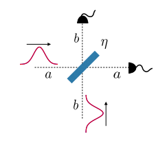
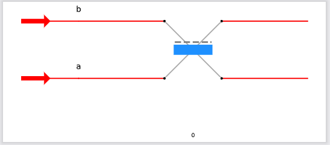
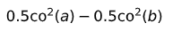
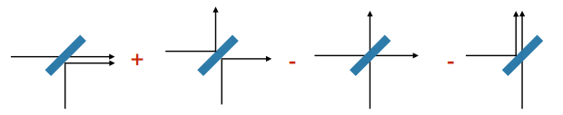
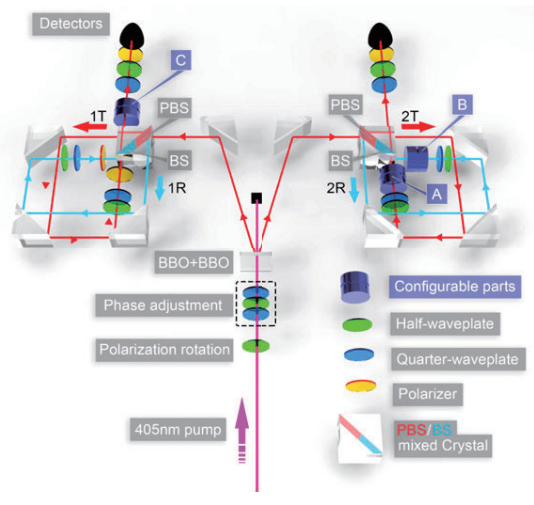
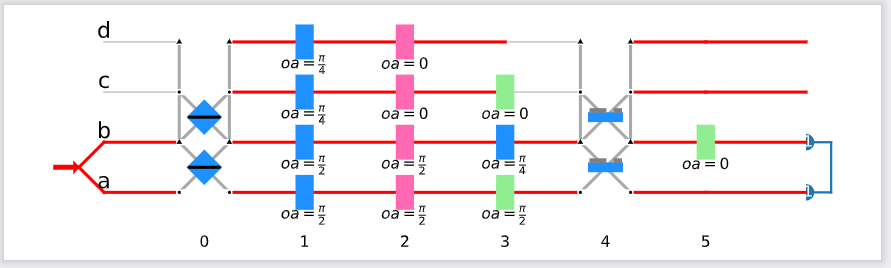
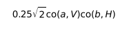

# PhotoniQLAB

## Introduction

PhotoniQLAB is a Python framework for simulating photonic quantum information processing (PQIP) experiments by an algebraic approach.

As we know, the scale and complexity of PQIP experiments grow rapidly.
The time-consuming and error-prone analyzing process for these complex experiments keeps annoying researchers.
Typically **hours of time and cooperator's rechecking** is needed to verify the correctness of an analysis.

Here comes PhotoniQLAB, a systematic software solution for the pain point.

We have also achieved more appealing goals in PhotoniQLAB beyond its basic duty:

- 🔧 Virtual photonic-lab-style user experience. You can specify a experiment in the similar way of building up the experimental setup in a real lab.
- ♾️ Universality. More than 60 existing PQIP experiments involving multiple encoded degree of freedoms covering various subareas have been simulated by PhotoniQLAB.
- ⚡️ Being efficient enough for most near-term use cases. Because PhotoniQLAB's creative operators manipulation system is strong but light-weight.

For more details of its context, please refer to our paper linked in the section of citation.

## Directory structure

```text
- photoniqlab
 - experiments.......Usage cases covering various fields
 - performance.......Code for performance tests
 - photoniqlab.......Source code of PhotoniQLAB
 - test..............Code for unit tests
```

## Installation

You can install our package by the following command under a Python 3.6 environment.

```bash
pip install -e .
```

## Usage

To get started with PhotoniQLAB to simulate a PQIP experiment, you need to create a Python script, e.g. `yourscript.py`, and describe the target PQIP experiment according to the step-by-step tutorial in PhotoniQLAB paper shown in the section of citation.

You can run the Python script to perform the simulation by the following command.

```bash
python yourscript.py
```

After the simulation process finished, you can get some output pdf files containing the simulation results. The content of each file is described by the following table.

| File name | Description                    |
| ------------- | ------------------------------ |
| `init_state.pdf` | The initial state of the network |
| `after_layerX.pdf`   | The quantum state after X layers |
| `post_selected.pdf`   | The quantum state after post selection |
| `experiment.pdf`   | The schematic diagram of the network |

## Simulate real-life examples

### Hong-Ou-Mandel dip experiment

The experiment setup of Hong-Ou-Mandel dip experiment (see <https://doi.org/10.48550/arXiv.1711.00080>) is shown as follows.



The PhotoniQLAB code for simulate this experiment is shown as follows.

```python
# -*- coding: utf-8 -*-

from photoniqlab.sympy_widget import *
from photoniqlab import Experiment, Photons, Detectors, BD, BS, HWP, PBS, POL, PS, QWP

expt = Experiment()

p1 = Photons(1, ['path'], co('p1'))
p2 = Photons(1, ['path'], co('p1'))

bs = BS()

expt.add_sources(p1, p2)
expt.add_elements(bs)

p1.o[0] = bs.i[0]
p2.o[0] = bs.i[1]

expt.build()
expt.simulate()
```

PhotoniQLAB draws a schematic diagram of the experiment setup to help you debug your description.



PhotoniQLAB outputs the final quantum state of this experiment into a PDF file by the representation of creative operators.



From the result we can verify that the cases of outputting two photons at two sides simultaneously have been cancelled out.



### Quantum Bernoulli factory PQIP experiment

The experiment setup of the quantum Bernoulli factory (multiplication operation) PQIP implementation (see <https://doi.org/10.1088/2058-9565/ac2061>) is shown as follows.



The PhotoniQLAB code for simulate this experiment is shown as follows.

```python
# -*- coding: utf-8 -*-

from photoniqlab.sympy_widget import *
from photoniqlab import Experiment, Photons, Detectors, BD, BS, HWP, PBS, POL, PS, QWP

expt = Experiment()

p = Photons(2, ['path', 'pol'], (1 / sqrt(2)) * co('p1', 'H') * co('p2', 'H') + (1 / sqrt(2)) * co('p1', 'V') * co('p2', 'V'))

pbs_1 = PBS()
pbs_2 = PBS()
bs_1 = BS()
bs_2 = BS()

hwp_1t = HWP(pi/4)
qwp_1t = QWP(0)
pol_1t = POL(0)

# h2 == 0
hwp_1r = HWP(pi/2)
qwp_1r = QWP(pi/2)
pol_1r = POL(pi/2)

hwp_2t = HWP(pi/4)
qwp_2t = QWP(0)

# h2 == 0
hwp_2r = HWP(pi/2)
qwp_2r = QWP(pi/2)
X = HWP(pi/4)  # B is X while A == C == I

pol_H = POL(0)
det = Detectors(2)

expt.add_sources(p)
expt.add_elements(pbs_1, pbs_2, bs_1, bs_2, hwp_1t, qwp_1t, pol_1t, hwp_1r, qwp_1r, pol_1r, hwp_2t, qwp_2t, hwp_2r, qwp_2r, X, pol_H)
expt.add_detectors(det)

p.o[0] = pbs_1.i[0]

pbs_1.o[0] = hwp_1r.i[0]
hwp_1r.o[0] = qwp_1r.i[0]
qwp_1r.o[0] = pol_1r.i[0]

pbs_1.o[1] = hwp_1t.i[0]
hwp_1t.o[0] = qwp_1t.i[0]
qwp_1t.o[0] = pol_1t.i[0]

pol_1r.o[0] = bs_1.i[0]
pol_1t.o[0] = bs_1.i[1]

bs_1.o[0] = det.i[0]

p.o[1] = pbs_2.i[0]

pbs_2.o[0] = hwp_2r.i[0]
hwp_2r.o[0] = qwp_2r.i[0]
qwp_2r.o[0] = X.i[0]
X.o[0] = bs_2.i[0]

pbs_2.o[1] = hwp_2t.i[0]
hwp_2t.o[0] = qwp_2t.i[0]
qwp_2t.o[0] = bs_2.i[1]

bs_2.o[0] = pol_H.i[0]
pol_H.o[0] = det.i[1]

expt.build()
expt.simulate()
```

PhotoniQLAB draws a schematic diagram of the experiment setup to help you debug your description.



PhotoniQLAB outputs the final quantum state of this experiment into a PDF file by the representation of creative operators, from which we can verify $\ket{h_1, 0}$ has been turned into $\ket{h_1 \cdot 0}$.



## Citation

If PhotoniQLAB helps you in your research, please cite our paper :)

```latex
@article{Wu_2021,
doi = {10.1088/2058-9565/abc1ba},
url = {https://dx.doi.org/10.1088/2058-9565/abc1ba},
year = {2021},
month = {jan},
publisher = {IOP Publishing},
volume = {6},
number = {2},
pages = {024001},
author = {Zhihao Wu and Junjie Wu and Anqi Huang},
title = {PhotoniQLAB: a framework for simulating photonic quantum information processing experiments},
journal = {Quantum Science and Technology}
}
```

## License

This project is under apache 2.0 license.
